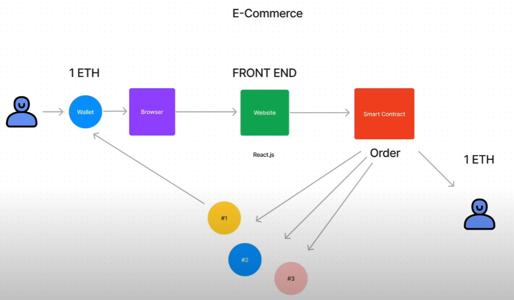
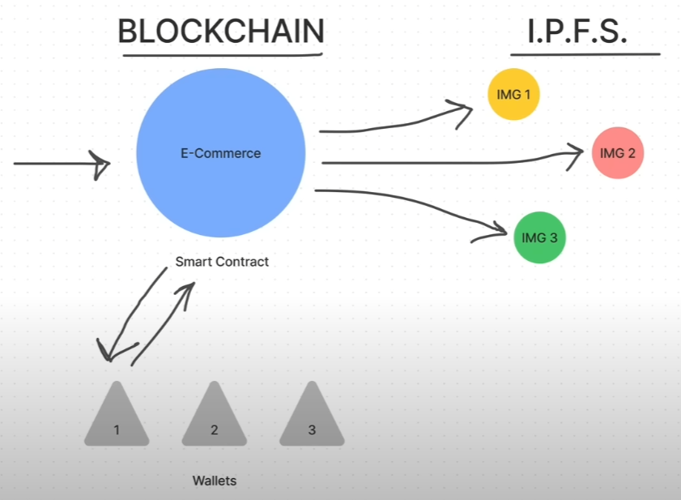

# Dappazon / Web3.0-AmazonClone

## Technology Stack & Tools

- [Javascript](https://developer.mozilla.org/en-US/docs/Web/JavaScript) (React & Testing)
- [React.js](https://reactjs.org/) (Frontend Framework)
- [Solidity](https://docs.soliditylang.org/en/v0.8.17/) (Writing Smart Contracts & Tests)
- [Hardhat](https://hardhat.org/) (Development Framework)
- [Ethers.js](https://docs.ethers.io/v5/) (Blockchain Interaction)
- [Metamask](https://docs.metamask.io/guide/) (Blockchain Connection)

---
Web3 E-Commerce arquitecture

Img storage in [IPFS](https://en.wikipedia.org/wiki/InterPlanetary_File_System)

---

## Requirements For Initial Setup
- Install [NodeJS](https://nodejs.org/en/)

## Setting Up
### 1. Clone/Download the Repository

### 2. Install Dependencies:
`$ npm install`

### 3. Run tests
`$ npx hardhat test`

### 4. Start Hardhat node
`$ npx hardhat node`

### 5. Run deployment script
In a separate terminal execute:
`$ npx hardhat run ./scripts/deploy.js --network localhost`

### 6. Start frontend
`$ npm run start`

---

### Credits for [Dapp University](https://www.dappuniversity.com/)